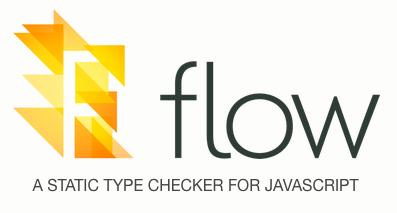

# Typing in React

TODO

## Adding Type Checking with Flow



As we saw earlier with `onEdit`, it gave us a nasty error before we actually defined a handler for the case. Thanks to [Flow](http://flowtype.org/) and [Flowcheck](https://gcanti.github.io/flowcheck/) we can add typing information to our source. This is very useful in a situation where you are working with large project and many developers

We can set up Flow type checking to our webpack easily by first doing `npm i flowcheck-loader --save-dev` and then extending our development configuration a little like this:

```javascript
if(TARGET === 'dev') {
  module.exports = merge(common, {
    ...
    module: {
      ...
      loaders: {
        {
          test: /\.jsx?$/,
          loaders: ['react-hot', 'babel?stage=1', 'flowcheck'],
          include: path.resolve(ROOT_PATH, 'app')
        }
      }
    },
    ...
  });
}
```

Now we can start typing. For instance you could attach types for `Note` props like this:

```javascript
constructor(props: {
  value: string;
  onEdit: Function;
}) {...}
```

`Notes` would look similar expect in that case we would perform an assertion like

```javascript
constructor(props: {
  items: Array;
  onEdit: Function;
}) {...}
```

With Flow you can type the most vital parts of your source. You can think it as an executable form of documentation that helps you during development. As with linting it won't replace tests but it will make it easier to work with the source. See [Try Flow](https://tryflow.org/) for more concrete examples.

### Patching Tools to Work with Decorators


As we'll be relying on decorators and still like to use Flowcheck, we'll need to tweak configuration a little bit:

**webpack.config.js**

```javascript
if(TARGET === 'dev') {
  module.exports = merge(common, {
    ...
    module: {
      loaders: [
        {
          test: /\.jsx?$/,
          loaders: ['react-hot', 'babel', 'flowcheck', 'babel?stage=1&blacklist=flow'],
          include: path.resolve(ROOT_PATH, 'app')
        }
      ]
    }
  });
}
```

In effect we're letting Babel process everything except Flow parts before passing the output to Flowcheck. After the check has completed, we'll deal with the rest. This is bit of a hack that will hopefully go away sometime in the future as technology becomes more robust.

## Conclusion

TODO
